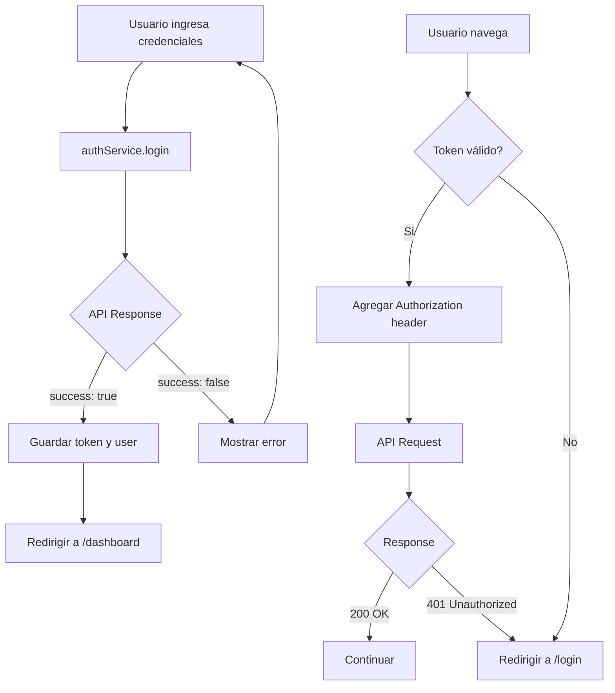

# Servicio de Autenticación API

Este documento describe el servicio de autenticación integrado con la API real del sistema.

## 📁 Ubicación

```
lib/api/auth.ts
```

## 🔧 Configuración

### URL Base de la API

```typescript
const API_BASE_URL = 'http://192.168.1.72:8082';
```

Para cambiar la URL, edita la constante en `lib/api/auth.ts`.

## 🚀 Uso

### 1. Login

```typescript
import { authService } from '@/lib/api/auth';

const handleLogin = async () => {
  try {
    const response = await authService.login('jgomez', 'VeintiunoDeOctubre!');
    
    console.log('Login exitoso!');
    console.log('Token:', response.token);
    console.log('Usuario:', response.user);
    console.log('Roles:', response.user.roles);
    
  } catch (error) {
    console.error('Error en login:', error.message);
  }
};
```

### 2. Logout

```typescript
import { authService } from '@/lib/api/auth';

const handleLogout = () => {
  authService.logout();
  // Redirigir al login
  router.push('/login');
};
```

### 3. Obtener Usuario Actual

```typescript
import { authService } from '@/lib/api/auth';

const user = authService.getCurrentUser();
if (user) {
  console.log('Username:', user.username);
  console.log('Roles:', user.roles);
  console.log('Is Root:', user.isRoot);
}
```

### 4. Verificar Autenticación

```typescript
import { authService } from '@/lib/api/auth';

if (authService.isAuthenticated()) {
  console.log('Usuario autenticado');
} else {
  console.log('Usuario NO autenticado');
}
```

### 5. Obtener Token

```typescript
import { authService } from '@/lib/api/auth';

const token = authService.getToken();
if (token) {
  console.log('Token JWT:', token);
}
```

## 📊 Estructura de Respuesta

### Respuesta de Login

```typescript
interface ParsedLoginResponse {
  expiresIn: string;
  message: string;
  requireIdentity: boolean;
  success: boolean;
  token: string;
  user: {
    email: string;
    id: string;
    isRoot: string;  // "S" = Si, "N" = No
    nombre: string;
    roles: Array<{
      RolId: string;
      RolNombre: string;
      RolTipo: string;  // "G" = Gestión
    }>;
    username: string;
  };
  verifiedBy: string;
}
```

### Ejemplo de Respuesta Real

```json
{
  "expiresIn": "0",
  "message": "",
  "requireIdentity": false,
  "success": true,
  "token": "eyJ0eXAiOiJKV1QiLCJhbGciOiJIUzI1NiJ9...",
  "user": {
    "email": "",
    "id": "5",
    "isRoot": "S",
    "nombre": "",
    "roles": [
      {
        "RolId": "1",
        "RolNombre": "Administrador del Puesto",
        "RolTipo": "G"
      }
    ],
    "username": "JGOMEZ"
  },
  "verifiedBy": ""
}
```

## 🔐 Manejo de Tokens

### Almacenamiento Automático

El servicio automáticamente guarda en `localStorage`:
- **Token JWT**: `trackmovil_token`
- **Datos de Usuario**: `trackmovil_user`

### Interceptores de Axios

#### Request Interceptor
Agrega automáticamente el token JWT a todas las peticiones:

```typescript
headers: {
  Authorization: 'Bearer <token>'
}
```

#### Response Interceptor
Maneja errores 401 (no autorizado):
- Limpia localStorage
- Redirige a `/login`

## 🌐 Cliente API Genérico

Para hacer otras peticiones a la API:

```typescript
import { apiClient } from '@/lib/api/auth';

// GET request
const response = await apiClient.get('/puestos/gestion/algun-endpoint');

// POST request
const response = await apiClient.post('/puestos/gestion/otro-endpoint', {
  data: 'ejemplo'
});

// PUT request
const response = await apiClient.put('/puestos/gestion/actualizar', {
  id: 123,
  campo: 'valor'
});

// DELETE request
const response = await apiClient.delete('/puestos/gestion/eliminar/123');
```

El token JWT se agrega automáticamente a todas estas peticiones.

## 🎯 Integración con AuthContext

El `AuthContext` ya está integrado con este servicio:

```typescript
// En AuthContext.tsx
import { authService } from '@/lib/api/auth';

const login = async (username: string, password: string) => {
  const response = await authService.login(username, password);
  // Maneja la respuesta...
};
```

## ⚠️ Manejo de Errores

### Errores Comunes

1. **Error de conexión**
   ```
   Error de conexión con el servidor
   ```
   - Verifica que la API esté corriendo
   - Verifica la URL base

2. **Credenciales inválidas**
   ```
   Error en el login
   ```
   - Usuario o contraseña incorrectos

3. **Token expirado (401)**
   - Redirección automática a `/login`

### Ejemplo de Manejo

```typescript
try {
  const response = await authService.login(username, password);
  // Login exitoso
} catch (error) {
  if (error.message.includes('conexión')) {
    // Error de red
  } else {
    // Otro tipo de error
  }
}
```

## 🔄 Flujo de Autenticación



## 📝 Notas Importantes

1. **Seguridad**: El token se guarda en `localStorage`. Para mayor seguridad en producción, considera usar cookies HttpOnly.

2. **CORS**: Asegúrate de que la API permita peticiones desde el dominio del frontend.

3. **Timeout**: Las peticiones tienen un timeout de 10 segundos. Ajústalo según necesites en `lib/api/auth.ts`:
   ```typescript
   timeout: 10000, // 10 segundos
   ```

4. **HTTPS**: En producción, usa HTTPS para encriptar las comunicaciones.

## 🧪 Testing

### Test de Login

```bash
# En la consola del navegador (F12)
```javascript
const { authService } = await import('./lib/api/auth');
const response = await authService.login('jgomez', 'VeintiunoDeOctubre!');
console.log(response);
```
```

## 📚 Tipos TypeScript

Todos los tipos están exportados y disponibles:

```typescript
import { 
  LoginCredentials, 
  LoginResponse, 
  ParsedLoginResponse 
} from '@/lib/api/auth';
```

## 🔗 Endpoints Disponibles

| Método | Endpoint | Descripción |
|--------|----------|-------------|
| POST | `/puestos/gestion/login` | Login de usuario |

Para agregar más endpoints, extiende el objeto `apiClient`.
