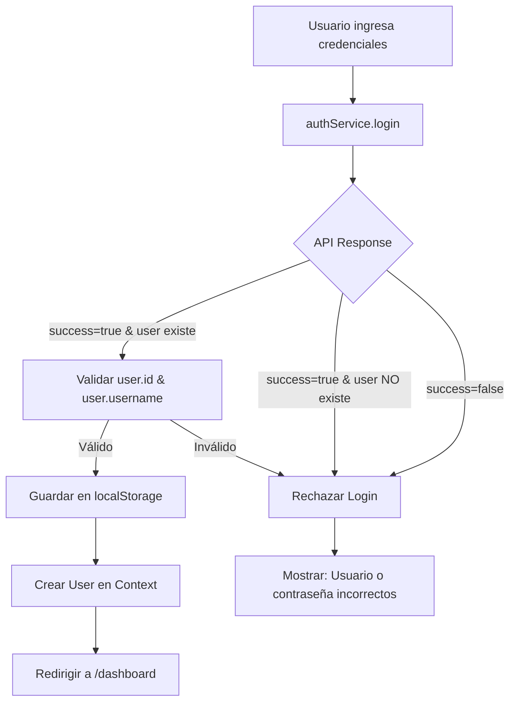

# ✅ Correcciones Finales - Sistema de Autenticación

## 🐛 Problemas Resueltos

### 1. Error JSON.parse en localStorage
**Error**: `JSON.parse: unexpected character at line 1 column 1`

**Causa**: Datos corruptos en localStorage

**Solución**:
- ✅ Validación de formato JSON antes de parsear
- ✅ Validación de estructura de usuario
- ✅ Auto-limpieza de datos corruptos
- ✅ Try-catch robusto con logging

### 2. Login Sin Usuario Considerado Válido
**Problema**: `success: true` sin objeto `user` permitía login

**Solución**:
- ✅ Validación estricta: requiere `user.id` y `user.username`
- ✅ Mensaje claro: "Usuario o contraseña incorrectos"
- ✅ No guardar en localStorage si falta usuario

## 🔧 Cambios Implementados

### 1. AuthContext.tsx

#### Carga de Sesión (useEffect)
```typescript
useEffect(() => {
  const savedUser = localStorage.getItem('trackmovil_user');
  const savedToken = localStorage.getItem('trackmovil_token');
  
  if (savedUser && savedToken) {
    try {
      // Validar formato JSON
      if (!savedUser.startsWith('{')) {
        throw new Error('Invalid user data format');
      }
      
      const parsedUser = JSON.parse(savedUser);
      
      // Validar estructura
      if (!parsedUser.username || !parsedUser.id) {
        throw new Error('Invalid user data structure');
      }
      
      setUser({ ...parsedUser, token: savedToken });
    } catch (e) {
      console.error('Error al cargar sesión, limpiando localStorage:', e);
      localStorage.removeItem('trackmovil_user');
      localStorage.removeItem('trackmovil_token');
    }
  }
  setIsLoading(false);
}, []);
```

#### Método Login
```typescript
const login = async (username: string, password: string) => {
  try {
    const response = await authService.login(username, password);
    
    // Validación estricta
    if (response.success && response.user && response.user.id && response.user.username) {
      const newUser: User = {
        id: response.user.id,
        username: response.user.username,
        email: response.user.email || '',
        nombre: response.user.nombre || response.user.username,
        isRoot: response.user.isRoot || 'N',
        roles: response.user.roles || [],
        loginTime: new Date().toISOString(),
        token: response.token,
      };
      
      setUser(newUser);
      return { success: true };
    } else if (response.success && !response.user) {
      // Success=true pero sin usuario
      return { 
        success: false, 
        error: 'Usuario o contraseña incorrectos' 
      };
    } else {
      return { 
        success: false, 
        error: response.message || 'Usuario o contraseña incorrectos' 
      };
    }
  } catch (error) {
    console.error('Error en login:', error);
    return { 
      success: false, 
      error: error instanceof Error ? error.message : 'Error de conexión con el servidor' 
    };
  }
};
```

### 2. lib/api/auth.ts

```typescript
login: async (username: string, password: string) => {
  try {
    const credentials = { UserName: username, Password: password };
    const response = await apiClient.post('/puestos/gestion/login', credentials);
    
    const parsedResponse = JSON.parse(response.data.RespuestaLogin);
    
    if (!parsedResponse.success) {
      throw new Error(parsedResponse.message || 'Error en el login');
    }
    
    // Solo guardar si hay usuario válido
    if (parsedResponse.user && parsedResponse.user.id && parsedResponse.user.username) {
      localStorage.setItem('trackmovil_token', parsedResponse.token);
      localStorage.setItem('trackmovil_user', JSON.stringify(parsedResponse.user));
    } else {
      console.warn('⚠️ Login success=true pero sin datos de usuario. Considerando como login inválido.');
    }
    
    return parsedResponse;
  } catch (error) {
    // Handle errors...
  }
}
```

## 📊 Lógica de Validación

### Respuesta VÁLIDA ✅
```json
{
  "RespuestaLogin": "{
    \"success\": true,
    \"token\": \"eyJ0eXAi...\",
    \"user\": {
      \"id\": \"5\",
      \"username\": \"JGOMEZ\",
      \"email\": \"\",
      \"nombre\": \"\",
      \"isRoot\": \"S\",
      \"roles\": [...]
    }
  }"
}
```
**Resultado**: ✅ Login exitoso, redirige a `/dashboard`

### Respuesta INVÁLIDA ❌
```json
{
  "RespuestaLogin": "{
    \"success\": true,
    \"token\": \"eyJ0eXAi...\",
    \"requireIdentity\": true
  }"
}
```
**Resultado**: ❌ "Usuario o contraseña incorrectos"

## 🔄 Flujo de Login Actualizado



## 🧹 Limpieza de localStorage

### Método 1: Consola (F12)
```javascript
localStorage.removeItem('trackmovil_user');
localStorage.removeItem('trackmovil_token');
location.reload();
```

### Método 2: Auto-limpieza
El sistema ahora limpia automáticamente datos corruptos al detectarlos.

## ✅ Checklist de Validación

### En authService.login():
- [x] Parsear `RespuestaLogin`
- [x] Verificar `success === true`
- [x] Verificar que `user` existe
- [x] Verificar `user.id` existe
- [x] Verificar `user.username` existe
- [x] Solo entonces guardar en localStorage

### En AuthContext.login():
- [x] Validar respuesta del servicio
- [x] Validar estructura del usuario
- [x] Crear objeto User con fallbacks
- [x] Retornar error específico si falta usuario

### En useEffect (cargar sesión):
- [x] Validar formato JSON
- [x] Validar estructura del usuario
- [x] Auto-limpiar si hay error
- [x] Manejar excepciones gracefully

## 🎯 Casos de Uso

### Caso 1: Credenciales Correctas
```
Input: jgomez / VeintiunoDeOctubre!
API Response: { success: true, user: {...}, token: "..." }
Resultado: ✅ Login exitoso
```

### Caso 2: Credenciales Incorrectas (sin user)
```
Input: wronguser / wrongpass
API Response: { success: true, requireIdentity: true, token: "..." }
Resultado: ❌ "Usuario o contraseña incorrectos"
```

### Caso 3: Error de API
```
Input: cualquier cosa
API Response: { success: false, message: "Error" }
Resultado: ❌ "Error"
```

### Caso 4: localStorage Corrupto
```
localStorage.trackmovil_user = "invalid json"
Resultado: Auto-limpieza + mostrar login
```

## 📝 Archivos Modificados

```
✅ contexts/AuthContext.tsx
   - Validación robusta en useEffect
   - Validación estricta en login()
   - Fallbacks para campos opcionales
   
✅ lib/api/auth.ts
   - No crear usuario básico
   - Solo guardar si usuario es válido
   - Warning cuando falta usuario
```

## 🚀 Testing

### Test 1: Login Correcto
```bash
# Ejecutar
pnpm dev

# Navegar a
http://localhost:3000/login

# Ingresar
Usuario: jgomez
Password: VeintiunoDeOctubre!

# Resultado esperado
✅ Redirige a /dashboard
✅ localStorage tiene user y token
✅ Navbar muestra "JGOMEZ"
```

### Test 2: Login Incorrecto
```bash
# Ingresar credenciales incorrectas
Usuario: wrong
Password: wrong

# Resultado esperado
❌ "Usuario o contraseña incorrectos"
❌ NO redirige
❌ localStorage vacío
```

### Test 3: localStorage Corrupto
```javascript
// En consola (F12)
localStorage.setItem('trackmovil_user', 'invalid');
location.reload();

// Resultado esperado
⚠️ Console: "Error al cargar sesión, limpiando localStorage"
✅ Auto-limpieza
✅ Muestra login
```

## 🎉 Estado Final

| Feature | Estado |
|---------|--------|
| Validación de JSON | ✅ |
| Auto-limpieza localStorage | ✅ |
| Validación estricta de usuario | ✅ |
| Mensaje de error claro | ✅ |
| No guardar usuario inválido | ✅ |
| Fallbacks en campos opcionales | ✅ |
| Logging de errores | ✅ |
| Try-catch robusto | ✅ |

---

**¡Sistema de autenticación robusto y completo!** 🚀
