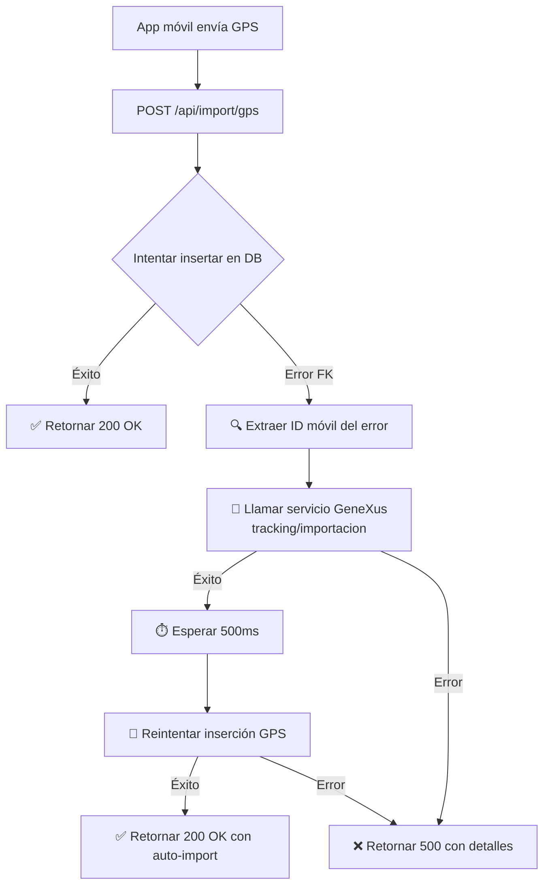

# 🔄 Auto-Import de Móviles en GPS Tracking

## 📋 Funcionalidad Implementada

Cuando el endpoint `/api/import/gps` recibe coordenadas GPS de un móvil que no existe en la base de datos, automáticamente:

1. **Detecta el error de integridad referencial** (código `23503` - foreign key violation)
2. **Extrae el ID del móvil** del mensaje de error
3. **Llama al servicio de importación de GeneXus** para sincronizar el móvil
4. **Reintenta la inserción** de las coordenadas GPS

## 🎯 Problema que Resuelve

**Antes**:
```
❌ Error al insertar GPS: {
  code: '23503',
  details: 'Key (movil_id)=(994) is not present in table "moviles".',
  message: 'insert or update on table "gps_tracking_extended" violates foreign key constraint "fk_gps_movil"'
}
```

Las coordenadas se perdían y el móvil no podía reportar su ubicación hasta que fuera manualmente importado.

**Ahora**:
```
⚠️ Error de integridad referencial detectado - móvil no existe
🔍 Móvil faltante identificado: 994
🔄 Importando móvil 994 desde GeneXus...
✅ Móvil 994 importado exitosamente
🔄 Reintentando inserción de GPS después de importar móvil 994...
✅ Inserción exitosa después de importar móvil 994
✅ 1 registros GPS insertados
```

## 🔧 Implementación

### Función de Importación

```typescript
async function importMovilFromGeneXus(movilId: number): Promise<boolean> {
  try {
    console.log(`🔄 Importando móvil ${movilId} desde GeneXus...`);
    
    const importUrl = 'https://sgm-dev.glp.riogas.com.uy/tracking/importacion';
    
    const response = await fetch(importUrl, {
      method: 'POST',
      headers: {
        'Content-Type': 'application/json',
      },
      body: JSON.stringify({
        EscenarioId: 1000,
        IdentificadorId: movilId,
        Accion: 'Publicar',
        Entidad: 'Moviles',
        ProcesarEn: 1,
      }),
    });

    if (!response.ok) {
      console.error(`❌ Error al importar móvil ${movilId}: HTTP ${response.status}`);
      return false;
    }

    const result = await response.json();
    console.log(`✅ Móvil ${movilId} importado exitosamente:`, result);
    
    // Pequeña espera para que se procese la importación
    await new Promise(resolve => setTimeout(resolve, 500));
    
    return true;
  } catch (error) {
    console.error(`❌ Error al importar móvil ${movilId}:`, error);
    return false;
  }
}
```

### Lógica de Manejo de Errores

```typescript
// Intentar insertar
let { data, error } = await supabase
  .from('gps_tracking_extended')
  .insert(transformedGps)
  .select();

// Si hay error de foreign key (móvil no existe)
if (error && error.code === '23503' && error.message.includes('fk_gps_movil')) {
  console.warn('⚠️ Error de integridad referencial detectado - móvil no existe');
  
  // Extraer el ID del móvil del mensaje de error
  // Ejemplo: 'Key (movil_id)=(994) is not present in table "moviles".'
  const match = error.details?.match(/\(movil_id\)=\((\d+)\)/);
  
  if (match && match[1]) {
    const movilId = parseInt(match[1]);
    console.log(`🔍 Móvil faltante identificado: ${movilId}`);
    
    // Intentar importar el móvil desde GeneXus
    const imported = await importMovilFromGeneXus(movilId);
    
    if (imported) {
      console.log(`🔄 Reintentando inserción de GPS después de importar móvil ${movilId}...`);
      
      // Reintentar la inserción
      const retryResult = await supabase
        .from('gps_tracking_extended')
        .insert(transformedGps)
        .select();
      
      data = retryResult.data;
      error = retryResult.error;
      
      if (!retryResult.error) {
        console.log(`✅ Inserción exitosa después de importar móvil ${movilId}`);
      }
    }
  }
}
```

## 📊 Flujo de Ejecución



## 🌐 Servicio de Importación Usado

**URL**: `https://sgm-dev.glp.riogas.com.uy/tracking/importacion`

**Método**: `POST`

**Payload**:
```json
{
  "EscenarioId": 1000,
  "IdentificadorId": <movilId>,
  "Accion": "Publicar",
  "Entidad": "Moviles",
  "ProcesarEn": 1
}
```

**Ejemplo**:
```bash
curl --location 'https://sgm-dev.glp.riogas.com.uy/tracking/importacion' \
  --header 'Content-Type: application/json' \
  --data '{
    "EscenarioId": 1000,
    "IdentificadorId": 994,
    "Accion": "Publicar", 
    "Entidad": "Moviles", 
    "ProcesarEn": 1 
  }'
```

## ⚙️ Configuración

No requiere configuración adicional. Usa la misma autenticación del endpoint GPS:

- **Header**: `X-API-Key` con `INTERNAL_API_KEY`
- **Body**: `token` con `GPS_TRACKING_TOKEN`

## 📈 Beneficios

1. **Cero pérdida de datos**: Las coordenadas GPS nunca se pierden
2. **Auto-recuperación**: El sistema se auto-corrige sin intervención manual
3. **Continuidad**: Los móviles pueden seguir reportando inmediatamente
4. **Logs detallados**: Fácil seguimiento de importaciones automáticas
5. **Resiliente**: Si falla la importación, retorna error descriptivo

## 🔍 Monitoreo

Buscar en logs de PM2:

```bash
# Ver importaciones automáticas
pm2 logs track | grep "Importando móvil"

# Ver reintentos exitosos
pm2 logs track | grep "Inserción exitosa después de importar"

# Ver errores de importación
pm2 logs track | grep "No se pudo importar el móvil"
```

## ⚠️ Consideraciones

1. **Performance**: Agrega ~500ms de latencia cuando un móvil nuevo reporta por primera vez
2. **Servicio externo**: Depende de la disponibilidad de `sgm-dev.glp.riogas.com.uy`
3. **Reintentos**: Solo intenta una vez (no hay retry loop infinito)
4. **Logs**: Genera logs adicionales para facilitar debugging

## 🧪 Testing

### Caso 1: Móvil Existente (Normal)
```bash
curl -X POST http://localhost:3002/api/import/gps \
  -H "Content-Type: application/json" \
  -H "X-API-Key: <tu-key>" \
  -d '{
    "movil": 1,
    "latitud": -34.9,
    "longitud": -56.1
  }'
```

**Resultado**: Inserción directa exitosa

### Caso 2: Móvil No Existente (Auto-Import)
```bash
curl -X POST http://localhost:3002/api/import/gps \
  -H "Content-Type: application/json" \
  -H "X-API-Key: <tu-key>" \
  -d '{
    "movil": 99999,
    "latitud": -34.9,
    "longitud": -56.1
  }'
```

**Resultado**: 
1. Error FK detectado
2. Importación automática del móvil 99999
3. Reintento exitoso
4. Coordenada guardada

---

**Archivo modificado**: `app/api/import/gps/route.ts`  
**Fecha**: 2026-02-04  
**Feature**: Auto-import de móviles al detectar foreign key violations
