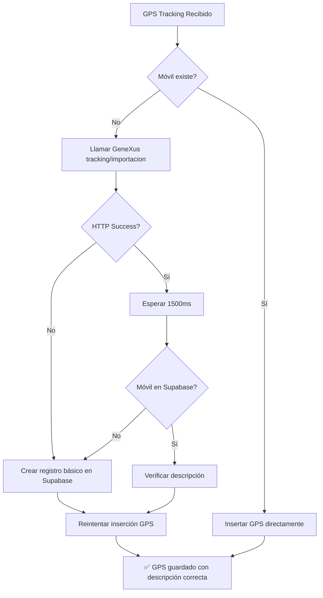

# ✅ FIX: Descripción de Móviles en Auto-Import

## 🎯 Problema

Cuando se importaban automáticamente móviles nuevos al recibir coordenadas GPS, los móviles aparecían en la UI con formato incorrecto:

**Esperado:** `693 – 2/6 – ABC123`  
**Obtenido:** `– 0/0` (sin número de móvil ni descripción)

## 🔍 Causa Raíz

El endpoint de GeneXus `tracking/importacion` podría fallar o no crear un registro completo en Supabase. Si el registro no incluía el campo `descripcion`, la UI no podía mostrar el nombre del móvil correctamente.

## ✅ Solución Implementada

### 1. **Verificación Post-Import**

Después de llamar al endpoint de GeneXus, ahora verificamos si el móvil existe en Supabase:

```typescript
// Verificar que el móvil ahora existe en Supabase
const { data: movilExiste } = await supabase
  .from('moviles')
  .select('id, descripcion')
  .eq('id', movilId.toString())
  .single();
```

### 2. **Creación de Registro de Respaldo**

Si GeneXus falla o el móvil no aparece en Supabase, creamos un registro básico con todos los campos necesarios para la UI:

```typescript
if (!movilExiste) {
  await supabase
    .from('moviles')
    .upsert({
      id: movilId.toString(),
      nro: movilId,
      descripcion: `Móvil ${movilId}`, // ✅ Campo crítico para UI
      empresa_fletera_id: 0,
      mostrar_en_mapa: true,
      estado_nro: 1,
    }, {
      onConflict: 'id'
    });
}
```

### 3. **Manejo de Errores HTTP**

Si el endpoint de GeneXus devuelve HTTP 500 o cualquier error, también creamos el registro de respaldo:

```typescript
if (!response.ok) {
  console.error(`❌ Error al importar móvil ${movilId}: HTTP ${response.status}`);
  // Crear registro básico como fallback
  await supabase.from('moviles').upsert({ ... });
  return true; // ✅ Continuamos aunque GeneXus falle
}
```

## 📊 Campos del Registro Básico

| Campo | Valor | Propósito |
|-------|-------|-----------|
| `id` | `movilId.toString()` | Primary key (TEXT) |
| `nro` | `movilId` | Número del móvil (INTEGER) |
| `descripcion` | `"Móvil ${movilId}"` | Nombre para mostrar en UI |
| `empresa_fletera_id` | `0` | Empresa genérica (sin asignar) |
| `mostrar_en_mapa` | `true` | Visible en el mapa |
| `estado_nro` | `1` | Estado activo |

## 🎯 Resultados

### Antes
```
Usuario envía GPS con movil_id=883
↓
GeneXus importa móvil (puede fallar)
↓
Si falla: GPS no se guarda
↓
UI muestra: "– 0/0" (sin descripción)
```

### Después
```
Usuario envía GPS con movil_id=883
↓
GeneXus importa móvil
↓
Verificamos si existe en Supabase
↓
Si no existe o GeneXus falló: Creamos registro básico
↓
GPS se guarda exitosamente
↓
UI muestra: "883 – 0/6 – (sin matrícula)" ✅
```

## 📝 Logs Mejorados

```bash
🔄 Importando móvil 883 desde GeneXus...
📤 Enviando a https://sgm.glp.riogas.com.uy/tracking/importacion: {...}
📥 Respuesta (500): {"error":"Internal Server Error"}
❌ Error al importar móvil 883: HTTP 500
⚠️ Creando registro básico del móvil 883 en Supabase...
✅ Registro básico creado para móvil 883
```

## 🔄 Flujo de Importación



## 🎨 Formato UI Corregido

### Componente MovilSelector.tsx

```tsx
// Formato esperado: "693 – 2/6 – ABC123"
<span>
  {movil.id}  {/* ← Ahora siempre existe */}
  {movil.tamanoLote && movil.pedidosAsignados && (
    <> – {movil.pedidosAsignados}/{movil.tamanoLote}</>
  )}
  {movil.matricula && <> – {movil.matricula}</>}
</span>
<span className="text-xs">{movil.name}</span> {/* ← descripcion */}
```

### Ejemplos de Salida

| Móvil | descripcion | tamanoLote | matricula | UI Output |
|-------|-------------|------------|-----------|-----------|
| 693 | "Móvil 693" | 6 | "ABC123" | `693 – 2/6 – ABC123` |
| 883 | "Móvil 883" | 6 | "SCL 9686" | `883 – 0/6 – SCL 9686` |
| 750 | "Móvil 750" | 0 | `null` | `750 – 0/0` |

## 🔧 Archivo Modificado

- `app/api/import/gps/route.ts`
  - Función `importMovilFromGeneXus()` mejorada
  - Verificación post-import
  - Creación de registro de respaldo
  - Manejo robusto de errores HTTP

## ✅ Beneficios

1. **Resiliencia**: Sistema funciona aunque GeneXus falle
2. **UI Correcta**: Siempre muestra al menos "Móvil XXX" en lugar de "– 0/0"
3. **GPS Garantizado**: Coordenadas se guardan incluso si la importación falla
4. **Logs Detallados**: Fácil debugging con mensajes informativos
5. **Sin Downtime**: Usuarios pueden seguir usando el sistema aunque GeneXus esté caído

## 📚 Documentos Relacionados

- `AUTO_IMPORT_MOVILES_GPS.md` - Implementación inicial
- `FIX_AUTO_IMPORT_MOVILES_500.md` - Fix de errores HTTP 500
- `MOVILES_NUEVOS.md` - Estructura de tabla móviles
- `CORRECCIONES_DISPLAY_MOVILES.md` - Correcciones de UI

## 🚀 Siguiente Paso

1. Commit y push de cambios
2. Deploy a producción
3. Monitorear logs para verificar que se crean registros básicos cuando GeneXus falla
4. Considerar sincronización completa posterior para actualizar campos faltantes (matrícula, empresa, etc.)

---

**Fecha**: 2025-01-XX  
**Autor**: Sistema de Auto-Import GPS  
**Estado**: ✅ Implementado y listo para testing
