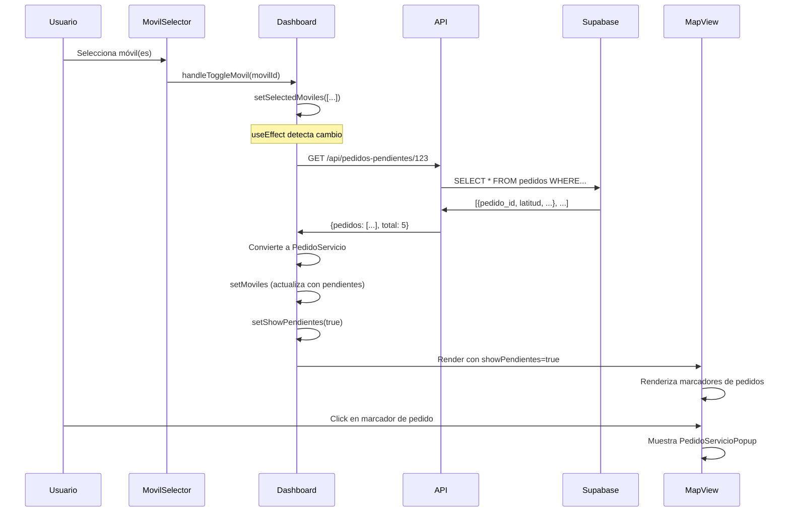

# 📦 Sistema de Pedidos Pendientes en el Mapa

## ✨ Nueva Funcionalidad Implementada

Cuando seleccionas uno o más móviles en la lista, ahora se cargan y muestran automáticamente sus **pedidos pendientes** en el mapa.

## 🎯 Características

### 1. Carga Automática de Pedidos
- ✅ Al seleccionar móviles, se cargan automáticamente sus pedidos pendientes
- ✅ Los pedidos se obtienen de la tabla `pedidos` de Supabase
- ✅ Solo se muestran pedidos NO cumplidos (`fecha_hora_cumplido IS NULL`)
- ✅ Solo pedidos con coordenadas válidas (`latitud` y `longitud` no nulos)

### 2. Visualización en el Mapa
- 📦 Marcadores naranjas para pedidos pendientes
- 📍 Popup con información detallada del pedido
- 🎨 Diseño consistente con el resto de la aplicación

### 3. Datos Mostrados

Cada pedido muestra:
- **Cliente**: Nombre, dirección, teléfono
- **Producto**: Nombre, código, cantidad
- **Detalles**: Prioridad, estado, observaciones
- **Fechas**: Fecha para entrega, fecha asignado
- **Ubicación**: Coordenadas GPS
- **Importes**: Flete, bruto, precio

## 📁 Archivos Creados/Modificados

### Nuevos Archivos

#### 1. `app/api/pedidos-pendientes/[movilId]/route.ts`
Endpoint API para obtener los pedidos pendientes de un móvil:

```typescript
GET /api/pedidos-pendientes/123?escenarioId=1
```

**Respuesta**:
```json
{
  "movilId": 123,
  "escenarioId": 1,
  "pedidos": [...],
  "total": 5
}
```

**Filtros aplicados**:
- `movil = movilId`
- `escenario_id = escenarioId`
- `fecha_hora_cumplido IS NULL` (solo pendientes)
- `latitud IS NOT NULL AND longitud IS NOT NULL`

**Orden**:
- Por prioridad (descendente)
- Por fecha_hora_para (ascendente)

### Archivos Modificados

#### 1. `types/index.ts`
Agregada interfaz `PedidoPendiente`:

```typescript
export interface PedidoPendiente {
  pedido_id: number;
  escenario_id: number;
  movil: number;
  estado: number | null;
  latitud: number;
  longitud: number;
  zona: number | null;
  tipo: string | null;
  nombre_servicio: string | null;
  producto_codigo: string | null;
  producto_nombre: string | null;
  producto_cantidad: number | null;
  producto_precio: number | null;
  prioridad: number;
  // ... más campos
}
```

#### 2. `app/dashboard/page.tsx`

##### Nueva función: `fetchPedidosPendientes`
```typescript
const fetchPedidosPendientes = useCallback(async (movilesIds: number[]) => {
  // Carga pedidos para todos los móviles seleccionados
  // Convierte a formato PedidoServicio para compatibilidad con MapView
  // Actualiza el estado de cada móvil con sus pedidos
}, []);
```

##### Nuevo useEffect
```typescript
useEffect(() => {
  if (selectedMoviles.length > 0) {
    fetchPedidosPendientes(selectedMoviles);
    setShowPendientes(true);  // Mostrar automáticamente
  } else {
    setShowPendientes(false);  // Ocultar si no hay selección
  }
}, [selectedMoviles, fetchPedidosPendientes]);
```

#### 3. `components/map/MapView.tsx`
- Agregado import de `PedidoPendiente`
- Ya existía la lógica para mostrar `pendientes` en el mapa
- Ya existía el componente `PedidoServicioPopup`

## 🔄 Flujo de Funcionamiento



## 🎨 Visualización

### Marcadores en el Mapa

```typescript
// Móvil activo
🚚 (azul/verde/rojo según empresa)

// Pedido pendiente
📦 (naranja)
```

### Popup de Pedido

```
┌─────────────────────────────────┐
│ 📦 PEDIDO         ID: 12345  [X]│
├─────────────────────────────────┤
│ 👤 Cliente                       │
│    Juan Pérez                    │
│    ID: 5678                      │
│                                  │
│ Estado: ⚠️ Pendiente  SubEst: 0 │
│                                  │
│ 📍 Ubicación                     │
│    Lat: -34.603722               │
│    Lng: -58.381592               │
│                                  │
│ 📅 Fecha para: 01/12/2025        │
└─────────────────────────────────┘
```

## 🔍 Consulta SQL Utilizada

```sql
SELECT 
  pedido_id,
  escenario_id,
  movil,
  estado,
  latitud,
  longitud,
  zona,
  tipo,
  nombre_servicio,
  producto_codigo,
  producto_nombre,
  producto_cantidad,
  producto_precio,
  prioridad,
  observacion,
  importe_flete,
  importe_bruto,
  fecha_para,
  fecha_hora_max_comp,
  fecha_hora_para,
  fecha_hora_asignado,
  fecha_hora_cumplido,
  cliente_nombre,
  cliente_direccion,
  cliente_nro,
  cliente_telefono,
  cliente_observacion,
  empresa_fletera_id
FROM pedidos
WHERE movil = $1
  AND escenario_id = $2
  AND fecha_hora_cumplido IS NULL
  AND latitud IS NOT NULL
  AND longitud IS NOT NULL
ORDER BY prioridad DESC, fecha_hora_para ASC
```

## 🎯 Casos de Uso

### Caso 1: Seleccionar un móvil
```
1. Usuario selecciona "Móvil 101"
2. Sistema carga pedidos pendientes de "Móvil 101"
3. Mapa muestra móvil + sus pedidos pendientes
4. Usuario puede hacer click en cada pedido para ver detalles
```

### Caso 2: Seleccionar múltiples móviles
```
1. Usuario selecciona "Móvil 101" y "Móvil 102"
2. Sistema carga pedidos de ambos móviles
3. Mapa ajusta zoom para mostrar todos
4. Marcadores naranjas (📦) para pedidos de ambos móviles
```

### Caso 3: Deseleccionar todos
```
1. Usuario hace "Limpiar Selección"
2. selectedMoviles = []
3. Sistema oculta pedidos automáticamente
4. Mapa muestra solo móviles
```

## 📊 Índices de Base de Datos

La tabla `pedidos` tiene índices optimizados:

```sql
-- Consultas por móvil
idx_pedidos_movil (movil, escenario_id)

-- Filtro de pendientes
idx_pedidos_pendientes (movil, estado, fecha_para)
WHERE fecha_hora_cumplido IS NULL

-- Filtro de ubicación
idx_pedidos_location (latitud, longitud)
WHERE latitud IS NOT NULL AND longitud IS NOT NULL

-- Orden por prioridad
idx_pedidos_prioridad (prioridad DESC, fecha_hora_para)
```

## 🚀 Mejoras Futuras (Opcionales)

1. **Filtros de Pedidos**
   - Por estado
   - Por prioridad
   - Por fecha
   - Por zona

2. **Agrupación de Pedidos**
   - Cluster markers cuando hay muchos pedidos cercanos
   - Mostrar número total en el cluster

3. **Rutas Optimizadas**
   - Sugerir orden óptimo de entrega
   - Calcular distancias entre pedidos

4. **Estadísticas**
   - Total de pedidos pendientes
   - Importe total
   - Tiempo estimado de entrega

## ✅ Resumen

| Feature | Estado |
|---------|--------|
| API endpoint creado | ✅ |
| Interfaz TypeScript | ✅ |
| Carga automática | ✅ |
| Visualización en mapa | ✅ |
| Popup con detalles | ✅ |
| Filtro de pendientes | ✅ |
| Orden por prioridad | ✅ |
| Múltiples móviles | ✅ |
| Auto-hide sin selección | ✅ |

---

**¡La funcionalidad está completa y lista para usar!** 🎉

## 🧪 Para Probar

1. Inicia el servidor: `pnpm dev`
2. Ve a: `http://localhost:3000/dashboard`
3. Selecciona uno o más móviles en la lista
4. Observa cómo aparecen los marcadores 📦 naranjas en el mapa
5. Click en un pedido para ver sus detalles
