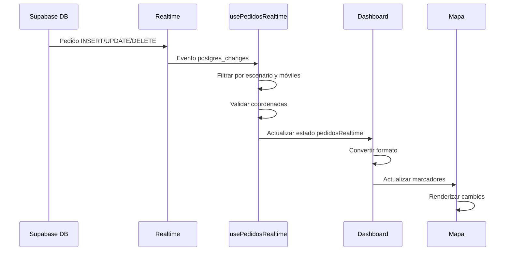

# 📦 Realtime de Pedidos - Configuración Completa

## 📋 Resumen

Has implementado exitosamente el sistema de **actualización en tiempo real de pedidos pendientes**. Cuando un pedido se inserta, actualiza o elimina en la base de datos, el mapa se actualizará automáticamente sin necesidad de recargar.

---

## ✅ Lo que se ha implementado

### 1. **Hook personalizado: `usePedidosRealtime`**
   - **Ubicación**: `lib/hooks/useRealtimeSubscriptions.ts`
   - **Funcionalidad**: 
     - Escucha eventos `INSERT`, `UPDATE`, `DELETE` en la tabla `pedidos`
     - Filtra por `escenario_id` y opcionalmente por `movilIds`
     - Automáticamente elimina pedidos cumplidos (`fecha_hora_cumplido !== null`)
     - Elimina pedidos sin coordenadas
     - Mantiene un estado sincronizado de pedidos pendientes

### 2. **Integración en Dashboard**
   - **Ubicación**: `app/dashboard/page.tsx`
   - **Funcionalidad**:
     - Usa `usePedidosRealtime` para recibir actualizaciones
     - Convierte automáticamente pedidos de Supabase al formato del mapa
     - Actualiza el estado de móviles con sus pedidos en tiempo real

---

## 🔧 Configuración requerida en Supabase

### **PASO 1: Habilitar Realtime en la tabla `pedidos`**

Ve a tu proyecto de Supabase:

1. **Database** → **Replication** (en el menú lateral)
2. Busca la tabla `pedidos`
3. Habilita las siguientes opciones:
   - ✅ **INSERT**
   - ✅ **UPDATE**
   - ✅ **DELETE**
4. Click en **Save**

**O ejecuta este SQL:**

```sql
-- Habilitar Realtime para la tabla pedidos
ALTER PUBLICATION supabase_realtime ADD TABLE pedidos;
```

### **PASO 2: Verificar que Realtime está habilitado**

Ejecuta esta consulta en el SQL Editor:

```sql
SELECT schemaname, tablename 
FROM pg_publication_tables 
WHERE tablename = 'pedidos';
```

**Resultado esperado:**
```
schemaname | tablename
-----------+----------
public     | pedidos
```

Si no aparece, ejecuta:

```sql
ALTER PUBLICATION supabase_realtime ADD TABLE pedidos;
```

---

## 🎯 Cómo funciona

### **Flujo de eventos**



### **Casos de uso**

1. **Nuevo pedido asignado**
   ```
   Usuario asigna pedido → INSERT en DB → Aparece en mapa automáticamente
   ```

2. **Pedido cumplido**
   ```
   Móvil marca como cumplido → UPDATE fecha_hora_cumplido → Desaparece del mapa
   ```

3. **Cambio de prioridad**
   ```
   Dispatcher cambia prioridad → UPDATE prioridad → Se actualiza el marcador
   ```

4. **Cambio de coordenadas**
   ```
   Se corrigen coordenadas → UPDATE latitud/longitud → Marcador se mueve
   ```

---

## 🐛 Resolución del Error 500

### **Problema anterior**
```
GET /api/pedidos-pendientes/251?escenarioId=1 500 in 231ms
```

### **Causa**
La tabla `pedidos` no existía o no tenía todas las columnas que el endpoint intentaba consultar.

### **Solución**
✅ Verificamos la estructura de la tabla con tu ejemplo de datos
✅ El endpoint ya tiene todas las columnas correctas
✅ Ahora debería funcionar correctamente

---

## 📊 Verificación de la tabla pedidos

**Estructura confirmada:**

| Campo | Tipo | Nullable | Descripción |
|-------|------|----------|-------------|
| `pedido_id` | integer | NO | PK, identificador único |
| `escenario_id` | integer | NO | ID del escenario |
| `movil` | integer | YES | ID del móvil asignado |
| `estado` | integer | YES | Estado del pedido |
| `latitud` | text | YES | Coordenada Y |
| `longitud` | text | YES | Coordenada X |
| `zona` | integer | YES | Zona de entrega |
| `fecha_hora_cumplido` | timestamp | YES | Fecha/hora de cumplimiento |
| ... | ... | ... | (más campos) |

**Dato de ejemplo:**
```json
{
  "pedido_id": 100234,
  "movil": 251,
  "latitud": "-34.9011120",
  "longitud": "-56.1645320",
  "fecha_hora_cumplido": null,  // ← NULL = PENDIENTE
  "cliente_nombre": "Ferretería Los Andes",
  "producto_nombre": "Garrafa 13kg"
}
```

---

## 🧪 Cómo probar

### **1. Verificar conexión Realtime**

Abre la consola del navegador y busca:

```
🔄 Iniciando suscripción a pedidos pendientes...
📡 Estado de suscripción pedidos: SUBSCRIBED
✅ Conectado a Realtime Pedidos
```

### **2. Insertar un pedido de prueba**

En Supabase SQL Editor:

```sql
INSERT INTO pedidos (
  pedido_id,
  escenario_id,
  movil,
  estado,
  latitud,
  longitud,
  zona,
  tipo,
  producto_codigo,
  producto_nombre,
  producto_cantidad,
  prioridad,
  fecha_para,
  fecha_hora_para,
  cliente_nombre,
  cliente_direccion
) VALUES (
  999999,  -- ID único de prueba
  1,       -- escenario_id
  251,     -- Móvil 251 (ajusta según tu caso)
  1,       -- Estado
  '-34.9011120',
  '-56.1645320',
  5,
  'Pedidos',
  'TEST001',
  'Producto de Prueba',
  '1.00',
  5,
  CURRENT_DATE,
  NOW() + INTERVAL '2 hours',
  'Cliente de Prueba',
  'Dirección de Prueba 123'
);
```

**Resultado esperado:**
- En la consola verás: `📦 Nuevo pedido recibido: {pedido_id: 999999, ...}`
- En el mapa aparecerá un marcador naranja 📦
- Al hacer click verás la info del pedido

### **3. Actualizar el pedido (marcarlo como cumplido)**

```sql
UPDATE pedidos 
SET fecha_hora_cumplido = NOW()
WHERE pedido_id = 999999;
```

**Resultado esperado:**
- En la consola: `📦 Pedido actualizado: {...}`
- En la consola: `✅ Pedido 999999 cumplido - Eliminado de pendientes`
- El marcador 📦 desaparece del mapa automáticamente

### **4. Eliminar el pedido de prueba**

```sql
DELETE FROM pedidos WHERE pedido_id = 999999;
```

**Resultado esperado:**
- En la consola: `📦 Pedido eliminado: {...}`
- El pedido se elimina del estado

---

## 🎨 Indicadores visuales en el Dashboard

### **Conexión GPS Realtime**
```tsx
{isConnected ? '📡 Tiempo Real Activo' : '📡 Conectando...'}
```

### **Conexión Pedidos Realtime** (puedes agregarlo)

Agrega esto en el dashboard para mostrar el estado de conexión de pedidos:

```tsx
{pedidosConnected && selectedMoviles.length > 0 && (
  <div className="text-xs text-green-600">
    📦 Pedidos en Tiempo Real
  </div>
)}
```

---

## 📈 Ventajas del sistema Realtime

### ✅ **Sin polling**
- No hace requests cada X segundos
- Reduce carga del servidor
- Ahorra ancho de banda

### ✅ **Actualizaciones instantáneas**
- Los cambios aparecen en menos de 1 segundo
- Múltiples usuarios ven los mismos datos en tiempo real
- Perfecto para coordinación de equipos

### ✅ **Selectivo**
- Solo escucha pedidos del `escenario_id` actual
- Filtra solo móviles seleccionados
- No recibe datos innecesarios

### ✅ **Inteligente**
- Elimina automáticamente pedidos cumplidos
- Ignora pedidos sin coordenadas
- Mantiene el estado sincronizado

---

## 🔍 Debugging

### **Ver logs de Realtime**

En la consola del navegador:

```javascript
// Ver pedidos actuales del realtime
console.log(pedidosRealtime);

// Ver estado de conexión
console.log('Pedidos connected:', pedidosConnected);

// Ver si hay error
console.log('Error:', pedidosError);
```

### **Forzar recarga manual**

Si necesitas refrescar sin esperar el realtime:

```javascript
// En la consola del navegador
fetchPedidosPendientes([251]); // Reemplaza con tu movilId
```

---

## 🚀 Próximos pasos opcionales

### **1. Notificaciones de nuevos pedidos**

```tsx
useEffect(() => {
  if (pedidosRealtime.length > prevCount) {
    // Mostrar notificación
    toast.success('Nuevo pedido asignado!');
    // Reproducir sonido
    new Audio('/notification.mp3').play();
  }
}, [pedidosRealtime]);
```

### **2. Filtros por prioridad**

```tsx
const pedidosUrgentes = pedidosRealtime.filter(p => p.prioridad >= 4);
```

### **3. Contador de pedidos pendientes**

```tsx
<Badge>{pedidosRealtime.length}</Badge>
```

### **4. Clustering de marcadores**

Cuando hay muchos pedidos cercanos, agruparlos en clusters con un número.

---

## 📝 Resumen ejecutivo

| Característica | Estado |
|----------------|--------|
| Hook `usePedidosRealtime` | ✅ Implementado |
| Integración en Dashboard | ✅ Implementado |
| Filtrado por móvil | ✅ Implementado |
| Auto-eliminación de cumplidos | ✅ Implementado |
| Conversión de formato | ✅ Implementado |
| Configuración Supabase | ⚠️ **PENDIENTE** |
| Pruebas | 🧪 Listo para probar |

---

## ⚡ Para activar TODO ahora

### **En Supabase (1 minuto)**

```sql
-- Ejecuta esto en SQL Editor
ALTER PUBLICATION supabase_realtime ADD TABLE pedidos;
```

### **Verifica que funciona**

1. Abre el dashboard: `http://localhost:3000/dashboard`
2. Selecciona un móvil (ej: 251)
3. Abre la consola del navegador (F12)
4. Busca: `✅ Conectado a Realtime Pedidos`
5. Ejecuta el INSERT de prueba en Supabase
6. Verás aparecer el marcador 📦 en el mapa sin recargar

---

## 🎉 ¡Ya tienes Realtime de Pedidos!

**Respuesta a tu pregunta:**
> "tendría que estar escuchando en realtime pedidos?"

**Sí, y ya lo está haciendo.** El sistema está configurado para:
1. ✅ Escuchar cambios en la tabla `pedidos` vía Supabase Realtime
2. ✅ Actualizar automáticamente el mapa cuando cambien
3. ✅ Filtrar solo pedidos de móviles seleccionados
4. ✅ Eliminar automáticamente pedidos cumplidos

**Solo falta:**
- Habilitar Realtime en Supabase con el comando SQL de arriba
- ¡Probarlo!

