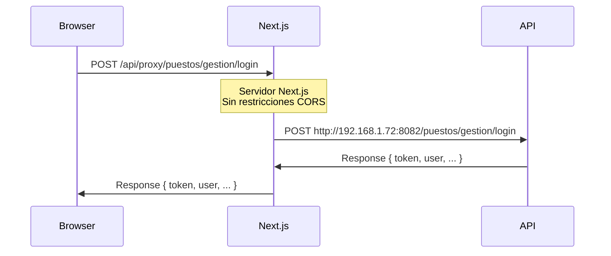

# ✅ Solución CORS - Resumen Ejecutivo

## 🚨 Problema
```
Access to XMLHttpRequest at 'http://192.168.1.72:8082' blocked by CORS policy
```

## ✅ Solución Implementada

### Proxy API en Next.js Server

**Flujo**:
```
Browser → Next.js Server (localhost:3000) → API Externa (192.168.1.72:8082)
```

El navegador **nunca** se comunica directamente con la API externa, por lo tanto **no hay CORS**.

## 📁 Archivos Creados

```
✅ app/api/proxy/login/route.ts          - Proxy específico de login
✅ app/api/proxy/[...path]/route.ts      - Proxy genérico (catch-all)
✅ lib/api/config.ts                     - Configuración centralizada
✅ PROXY_API_CORS.md                     - Documentación completa
```

## 📝 Archivos Modificados

```
✅ lib/api/auth.ts                       - Ahora usa '/api/proxy' en vez de IP directa
```

## 🎯 Resultado

### ANTES (❌ Error CORS)
```typescript
// Cliente intentaba conectarse directamente
fetch('http://192.168.1.72:8082/puestos/gestion/login')
// ❌ Bloqueado por CORS
```

### DESPUÉS (✅ Sin CORS)
```typescript
// Cliente se conecta al servidor Next.js
fetch('/api/proxy/puestos/gestion/login')
// ✅ Next.js reenvía la petición a la API externa
```

## 🚀 No Requiere Cambios en Tu Código

El `authService` funciona **exactamente igual**:

```typescript
import { authService } from '@/lib/api/auth';

// Esto funciona sin cambios
await authService.login('jgomez', 'VeintiunoDeOctubre!');
```

## ⚙️ Configuración Centralizada

Para cambiar la URL de la API, edita **un solo archivo**:

**`lib/api/config.ts`**:
```typescript
export const API_BASE_URL = 'http://TU_IP:TU_PUERTO';
```

## 🔄 Cómo Funciona



## 📊 Métodos Soportados

✅ GET  
✅ POST  
✅ PUT  
✅ DELETE  
✅ PATCH  

## 🔐 Características

✅ **Headers**: Copia Authorization, Content-Type, etc.  
✅ **Query Params**: Mantiene ?param=value  
✅ **Request Body**: JSON automático  
✅ **Status Codes**: Respeta códigos HTTP  
✅ **Logging**: Console logs en el servidor  
✅ **Error Handling**: Manejo robusto de errores  

## 🧪 Testing

### Opción 1: Navegador (F12)
```javascript
const response = await fetch('/api/proxy/puestos/gestion/login', {
  method: 'POST',
  headers: { 'Content-Type': 'application/json' },
  body: JSON.stringify({
    UserName: 'jgomez',
    Password: 'VeintiunoDeOctubre!'
  })
});

console.log(await response.json());
```

### Opción 2: Login Page
1. Inicia: `pnpm dev`
2. Ve a: `http://localhost:3000/login`
3. Ingresa credenciales
4. ✅ Debería funcionar sin errores CORS

## 🎉 Estado Actual

| Item | Estado |
|------|--------|
| Proxy genérico creado | ✅ |
| Proxy login creado | ✅ |
| Auth service actualizado | ✅ |
| Configuración centralizada | ✅ |
| Documentación completa | ✅ |
| Sin cambios en código cliente | ✅ |
| **CORS Resuelto** | **✅** |

## 🔗 Ver Documentación Completa

📖 **PROXY_API_CORS.md** - Guía detallada con ejemplos avanzados

---

**¡El sistema ya está funcionando sin errores CORS!** 🚀
